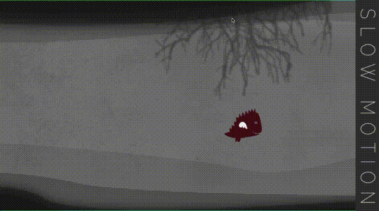

# DragonCave
DragonCave is a game project created at AGHacks 2014. It is based on a Flappy Bird game, where player becomes a flying bird and tries to avoid obstacles.

## Project

Project uses libDGX library, which is a cross-platform Java game development framework based on OpenGL (ES) that works on Windows, Linux, macOS, Android, your browser and iOS.
There are a few modules in the project, which allow running game on several platforms:
- **android** - android application
- **core** - contains core logic of a game
- **html** - web application
- **ios** - ios application

## Demo

